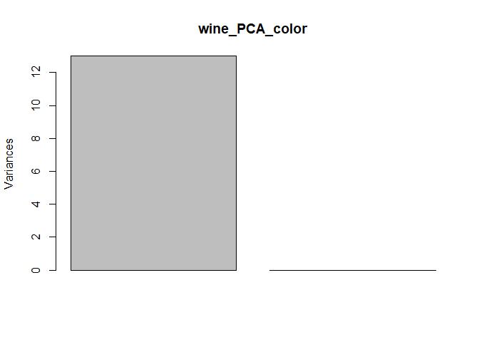
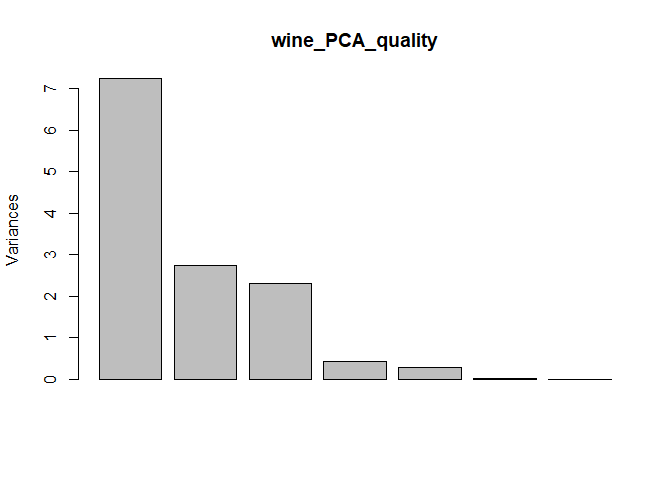
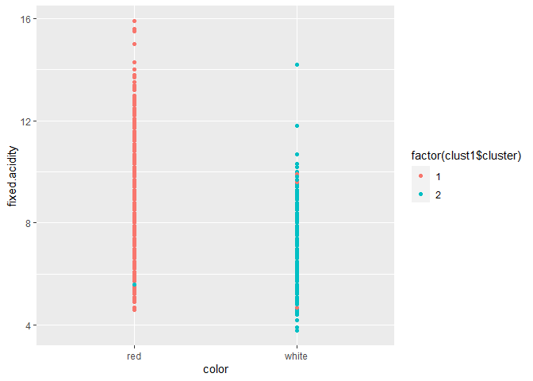
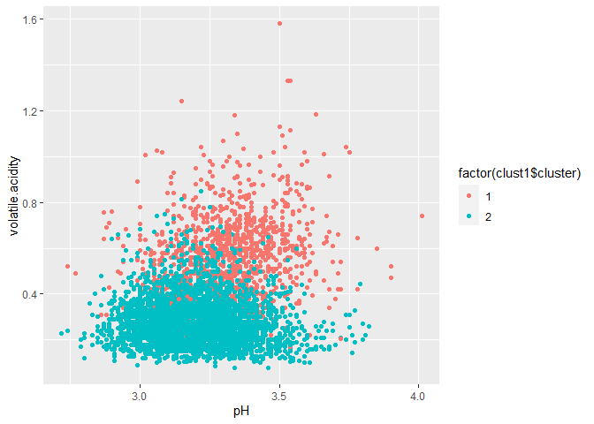
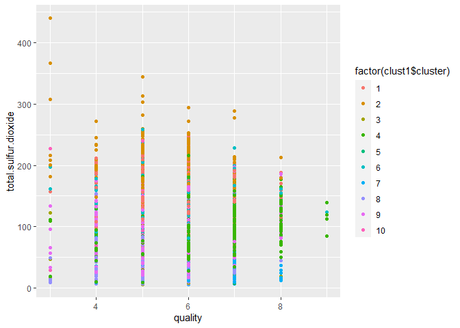
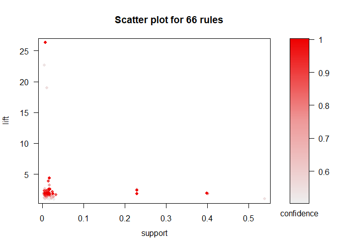
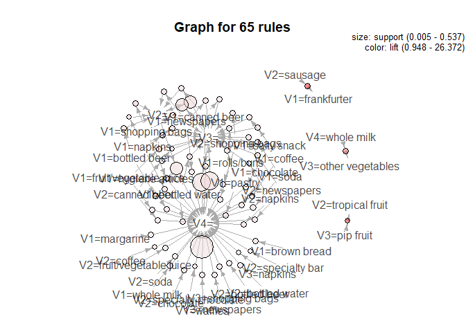
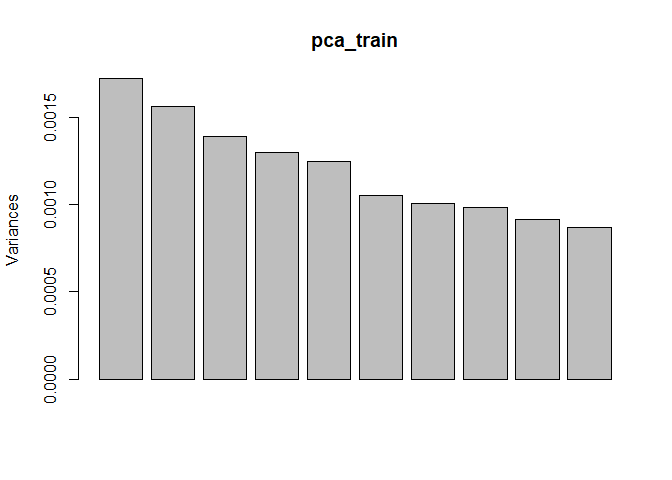
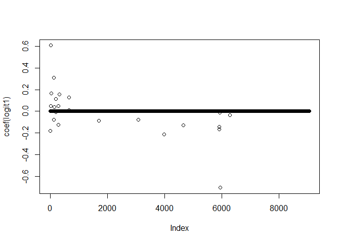
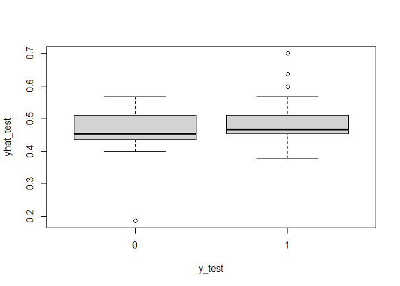

Data Mining\_HW4
================
Wen-Hsin Chang
2021/4/15

**Q1.Clustering and PCA**

*PCA Analysis*

Firstly, I will start with PCA analysis. According to the following
result, the PCA algorithm summarized the 11 chemical properties into 7
without any restriction initially.

    ## Importance of components:
    ##                           PC1    PC2    PC3     PC4     PC5    PC6       PC7
    ## Standard deviation     2.6918 1.6572 1.5153 0.64239 0.53495 0.1138 1.018e-14
    ## Proportion of Variance 0.5574 0.2112 0.1766 0.03174 0.02201 0.0010 0.000e+00
    ## Cumulative Proportion  0.5574 0.7686 0.9453 0.97699 0.99900 1.0000 1.000e+00

    ##                        PC1   PC2   PC3   PC4   PC5   PC6   PC7
    ## fixed.acidity        -0.16  0.51 -0.08  0.33 -0.34  0.23  0.07
    ## volatile.acidity     -0.28  0.31 -0.22 -0.11  0.35 -0.34  0.03
    ## citric.acid           0.33  0.03  0.20  0.09 -0.57 -0.19  0.19
    ## residual.sugar       -0.18 -0.17  0.53 -0.28 -0.08  0.38 -0.32
    ## chlorides            -0.36  0.11  0.00  0.06  0.17  0.18 -0.16
    ## free.sulfur.dioxide   0.03  0.31  0.52  0.37  0.42  0.23  0.16
    ## total.sulfur.dioxide -0.06  0.29  0.55 -0.31 -0.07 -0.51  0.01
    ## density              -0.37  0.03  0.00 -0.11 -0.22  0.28  0.68
    ## pH                    0.22  0.47 -0.12  0.13 -0.19  0.10 -0.47
    ## sulphates            -0.18 -0.44  0.16  0.65 -0.07 -0.14 -0.14
    ## alcohol               0.36  0.02  0.08  0.25  0.31 -0.17  0.31
    ## red                  -0.37  0.00  0.01  0.15 -0.13 -0.29 -0.06
    ## white                 0.37  0.00 -0.01 -0.15  0.13  0.29  0.09

To assess the capability of PCA in distinguishing reds from whites, I
plot the graph below. The result shows that PCA can distinguish the
difference between the reds and the whites.PC1 accounts for almost all
of the variation between reds and whites.

<!-- -->

    ## Importance of components:
    ##                          PC1       PC2
    ## Standard deviation     3.606 1.873e-14
    ## Proportion of Variance 1.000 0.000e+00
    ## Cumulative Proportion  1.000 1.000e+00

    ##                        PC1   PC2
    ## fixed.acidity         0.28 -0.12
    ## volatile.acidity      0.28 -0.10
    ## citric.acid          -0.28  0.05
    ## residual.sugar       -0.28  0.09
    ## chlorides             0.28 -0.09
    ## free.sulfur.dioxide  -0.28  0.10
    ## total.sulfur.dioxide -0.28  0.09
    ## density               0.28 -0.09
    ## pH                    0.28 -0.09
    ## sulphates             0.28 -0.12
    ## alcohol              -0.28 -0.94
    ## quality              -0.28 -0.10
    ## white                -0.28  0.09

To assess the capability of PCA in distinguishing higher and lower
quality wines, I conduct the following analysis. The results show that
the PCA also did a great job in distinguishing wine quality. The top 3
principal components account for almost 95% of variations.

<!-- -->

    ## Importance of components:
    ##                           PC1    PC2    PC3     PC4     PC5    PC6       PC7
    ## Standard deviation     2.6918 1.6572 1.5153 0.64239 0.53495 0.1138 1.018e-14
    ## Proportion of Variance 0.5574 0.2112 0.1766 0.03174 0.02201 0.0010 0.000e+00
    ## Cumulative Proportion  0.5574 0.7686 0.9453 0.97699 0.99900 1.0000 1.000e+00

    ##                        PC1   PC2   PC3   PC4   PC5   PC6   PC7
    ## fixed.acidity        -0.16  0.51 -0.08  0.33 -0.34  0.23  0.07
    ## volatile.acidity     -0.28  0.31 -0.22 -0.11  0.35 -0.34  0.03
    ## citric.acid           0.33  0.03  0.20  0.09 -0.57 -0.19  0.19
    ## residual.sugar       -0.18 -0.17  0.53 -0.28 -0.08  0.38 -0.32
    ## chlorides            -0.36  0.11  0.00  0.06  0.17  0.18 -0.16
    ## free.sulfur.dioxide   0.03  0.31  0.52  0.37  0.42  0.23  0.16
    ## total.sulfur.dioxide -0.06  0.29  0.55 -0.31 -0.07 -0.51  0.01
    ## density              -0.37  0.03  0.00 -0.11 -0.22  0.28  0.68
    ## pH                    0.22  0.47 -0.12  0.13 -0.19  0.10 -0.47
    ## sulphates            -0.18 -0.44  0.16  0.65 -0.07 -0.14 -0.14
    ## alcohol               0.36  0.02  0.08  0.25  0.31 -0.17  0.31
    ## red                  -0.37  0.00  0.01  0.15 -0.13 -0.29 -0.06
    ## white                 0.37  0.00 -0.01 -0.15  0.13  0.29  0.09

*K means clustering*

Next, I will conduct K means clustering method to distinguish the reds
from the whites. For the most important factor identified
previously-fixed.acidity, the following result shows that clustering did
well in distinguishing red wines compared to the whites.

<!-- -->

Next, I will conduct K means clustering method to distinguish the reds
from the whites. For the most important factor identified
previously-fixed.acidity, the following result shows that clustering did
well in distinguishing red wines compared to the whites.

<!-- -->

As for quality, it is harder to visualize the result. For instance, in
the case of total.sulfur.dioxide, the classification seems messier.

<!-- -->

In sum, I think the PCA analysis makes more sense to me because each
data point is like a combination of multiple basic “ingredients”. I
think we can also get the same conclusion when looking at the graph
above.

**Q2.Market segmentation**

I will use PCA algorithm to address market segmentation since each data
point is like a combination of basic “ingredients”. Firstly, I will
scale the data before I dive into PCA.

    ## Importance of first k=3 (out of 36) components:
    ##                           PC1    PC2    PC3
    ## Standard deviation     5.2035 4.3366 3.8224
    ## Proportion of Variance 0.1924 0.1336 0.1038
    ## Cumulative Proportion  0.1924 0.3260 0.4298

    ##                            PC1           PC2           PC3
    ## chatter           8.377923e-02  6.174357e-01 -0.2098548475
    ## current_events    1.674083e-02  5.633466e-02  0.0115752997
    ## travel            7.694647e-03  1.026362e-01  0.4025784281
    ## photo_sharing     1.319231e-01  4.784651e-01 -0.1649944164
    ## uncategorized     2.524063e-02  2.637812e-02  0.0002664109
    ## tv_film           5.842740e-03  3.273925e-02  0.0603144681
    ## sports_fandom     2.149987e-02  5.981140e-02  0.1540162070
    ## politics          7.858764e-03  1.707149e-01  0.6454785582
    ## food              9.520239e-02  1.097888e-02  0.1226658274
    ## family            1.999472e-02  4.337977e-02  0.0488461298
    ## home_and_garden   1.529762e-02  1.890571e-02  0.0147997876
    ## music             2.478241e-02  4.490862e-02  0.0069127597
    ## news              1.821436e-02  6.362012e-02  0.3251125707
    ## online_gaming     1.581928e-02  1.210238e-01  0.2096420578
    ## shopping          5.245830e-02  2.497367e-01 -0.0833536114
    ## health_nutrition  8.084217e-01 -2.731887e-01  0.0357546816
    ## college_uni       5.810219e-03  1.672739e-01  0.2416772692
    ## sports_playing    1.942244e-02  4.783238e-02  0.0532963684
    ## cooking           3.404963e-01  2.701636e-01 -0.1201330192
    ## eco               3.918988e-02  2.448001e-02  0.0102187798
    ## computers         1.599136e-02  6.154333e-02  0.1623149351
    ## business          1.321910e-02  3.705721e-02  0.0192118669
    ## outdoors          1.446150e-01 -3.628227e-02  0.0382913755
    ## crafts            2.138903e-02  2.954968e-02  0.0239538005
    ## automotive        6.331646e-03  7.134999e-02  0.1026726919
    ## art               1.932288e-02  2.483807e-02  0.0464870283
    ## religion          2.785915e-02  3.742165e-02  0.1194892604
    ## beauty            6.000130e-02  1.107477e-01 -0.0334058217
    ## parenting         2.929342e-02  4.023737e-02  0.0868603303
    ## dating            3.977599e-02  6.351116e-02  0.0321203464
    ## school            2.176039e-02  5.556398e-02  0.0387064883
    ## personal_fitness  3.873704e-01 -1.057094e-01  0.0201946620
    ## fashion           9.682483e-02  1.739817e-01 -0.0598367718
    ## small_business    5.570533e-03  2.839783e-02  0.0159787508
    ## spam              4.113457e-05  1.035245e-05  0.0004007636
    ## adult            -4.331520e-04  2.488791e-03 -0.0020797489

According to the result above, the top 1 principal component indicates
that NutrientH20’s most important categories are health\_nutrition,
cooking, and personal\_fitenss. It seems like a group of young
professionals who are economically independent and therefore care more
about foods, nutrition and personal\_fitenss. Since NutrientH20 is a
consumer drink brand, it may want to develop healthy drinks that can
catch this group of people’s attention.

The 2 nd principal component accounts for chatter, photo\_sharing, and
shopping. It seems like a group of people who are like to chat about
shopping and likes to share photos with their friends. NutrientH20 can
make beautiful design of their bottle to attract attention from these
people who love shopping and taking cool photos.

The 3 rd principal component correlated to politics and news. It is easy
to imagine these are a group of people who follow all the news and are
enthusiastic about politics. To position their brand, NutrientH20 can
sponsor some political campaigns by giving out some free drinks.

**Q3.Association rules for grocery purchases**

First of all, I import the data at take a look at what it contains

    ##                 V1                  V2             V3                       V4
    ## 1     citrus fruit semi-finished bread      margarine              ready soups
    ## 2   tropical fruit              yogurt         coffee                         
    ## 3       whole milk                                                            
    ## 4        pip fruit              yogurt  cream cheese              meat spreads
    ## 5 other vegetables          whole milk condensed milk long life bakery product
    ## 6       whole milk              butter         yogurt                     rice

To ensure the tightness of my estimation, I use confidence &gt; 0.5 &
support &gt; 0.005, lift &gt; 3 as thresholds. Under the restrictions,
the common combinations in my sample include \[whole milk, other
vegetables\], \[sausage,frankfurter\],and \[pip fruit, tropical fruit\].
The combinations make intuitive sense because they are mostly similar
categories of foods that people may buy together.

    ## Apriori
    ## 
    ## Parameter specification:
    ##  confidence minval smax arem  aval originalSupport maxtime support minlen
    ##         0.5    0.1    1 none FALSE            TRUE       5   0.005      1
    ##  maxlen target  ext
    ##       2  rules TRUE
    ## 
    ## Algorithmic control:
    ##  filter tree heap memopt load sort verbose
    ##     0.1 TRUE TRUE  FALSE TRUE    2    TRUE
    ## 
    ## Absolute minimum support count: 76 
    ## 
    ## set item appearances ...[0 item(s)] done [0.00s].
    ## set transactions ...[655 item(s), 15296 transaction(s)] done [0.01s].
    ## sorting and recoding items ... [168 item(s)] done [0.00s].
    ## creating transaction tree ... done [0.01s].
    ## checking subsets of size 1 2 done [0.00s].
    ## writing ... [66 rule(s)] done [0.00s].
    ## creating S4 object  ... done [0.00s].

    ##     lhs                   rhs                   support     confidence
    ## [1] {V2=sausage}       => {V1=frankfurter}      0.006472280 1.0000000 
    ## [2] {V3=pip fruit}     => {V2=tropical fruit}   0.005164749 0.5337838 
    ## [3] {V1=newspapers}    => {V2=}                 0.012029289 0.8932039 
    ## [4] {V1=shopping bags} => {V2=}                 0.017651674 1.0000000 
    ## [5] {V4=whole milk}    => {V3=other vegetables} 0.012160042 0.5454545 
    ## [6] {V1=canned beer}   => {V2=}                 0.018370816 0.7242268 
    ##     coverage    lift      count
    ## [1] 0.006472280 26.372414  99  
    ## [2] 0.009675732 22.743055  79  
    ## [3] 0.013467573  3.920358 184  
    ## [4] 0.017651674  4.389096 270  
    ## [5] 0.022293410 18.918986 186  
    ## [6] 0.025366109  3.178701 281

Finally, I provide the scatter plot of my association rules. The result
shows that most of the rules are condensed in the lower-left area of the
graph, and those areas are also where the confidence level is high.

<!-- -->

<!-- -->

**Q4.Author attribution**

Using the Reuters C50 corpus data, I conduct the following analysis.
First, I roll the two directories (author&text) together into a single
training corpus. For the word not seen before, I restrict test-set
vocabulary to the terms in training data. Below I list the first few
authors of the training set.

    ## [1] "C:/Users/user/Documents/GitHub/ECO395M/data/ReutersC50/C50train/SarahDavison"  
    ## [2] "C:/Users/user/Documents/GitHub/ECO395M/data/ReutersC50/C50train/TheresePoletti"

When forming the feature matrix, I use the TfIDf weighting scheme and
PCA algorithm to reduce dimensions.

<!-- -->

Next, I use a lasso regression for document classification. The
following result shows that the coefficients of logit results are
between -0.5 to 1.5.

<!-- -->

I also provide a boxplot of the performance of yhat\_test below. To
conclude, the lasso logistic regression has a relatively well test-set
performance in classifying the authors.

<!-- -->
